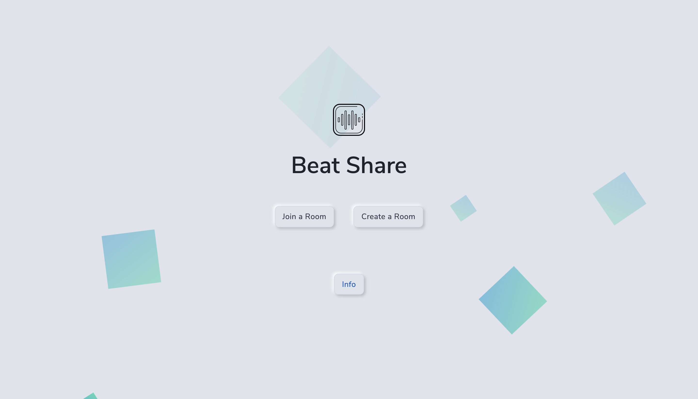

# BeatShare

Beat Share is a platform to collaboratively listen music with your friends/family. A host creates a room and any number of members can join it with the Room Code. Each member in the room can play/pause the current song and even skip it, though some terms and conditions apply.

<br/>



<br/>

**Visit website:** <a href="http://beatshare.in" target="_blank">http://beatshare.in</a>

**YouTube:** <a href="https://youtu.be/-B_bQyh_juY" target="_blank">https://youtu.be/-B_bQyh_juY</a>

<br/>

The host sets up play/pause controls while creating the room and can update the room settings later if needed. Members in the room need to vote to skip the current song. If the votes in favour exceed the votes required as set by the host, then the current song is skipped.

The application makes use of the Spotify API. So, the host needs to authenticate their Spotify account before setting up the room. Due to Spotify's updated version of the API, the host needs a premium Sportify account to access play/pause & skip controls from within the website.

<br/>

> **Note:** Only the host needs a premium account, other members in the room don't need to have a premium account.

<br/>

## Project Structure

<br/>

The application consists of three Django apps-

-   api,
-   frontend
-   spotify

**api**

The _api_ app contains the _Room_ model and the backend CRUD code of the application.

The views include-

_GetRoom:_ To get the room with the specified room code

_JoinRoom:_ Join a particular room having the specified room code

_CreateRoomView:_ Creates a room

_UserInRoom:_ To check if a particular user is in the room with the specified room code or not

_LeaveRoom:_ To leave the current room

_UpdateRoom:_ To update the room settings. Only the host of the room can call this endpoint.

<br/>

**frontend**

The _frontend_ app contains all the frontend code of the application. React JS is used to create all the frontend components. Material UI is used for creating the underlying visible website components.

_package.json:_ Contains info about all the packages used for the frontend

_templates/frontend/index.html:_ The main html file that renders all react components

_static/:_ Contains all static assets for the project. All css and js scripts and in the css folder. The _frontend_ folder contains the compiled _main.js_

_src/components/BeatShare/:_ Contains all components of the application.

-   CreateRoomPage.js: Page where the host creates a room.

-   Homepage.js: Homepage of the application.

-   Info.js: The about page of the application.

-   JoinRoomPage.js: Page where the users can join a particular room by entering the room code.

-   MusicPlayer.js: The music player in the Room page.

-   Room.js: The Room page.

<br/>

**spotify**

The _spotify_ app contains all logic to interact with the spotify API.

The _models_ include **SpotifyToken** and **Vote**.
_SpotifyToken_ model stores the API token that is received from Spotify and the _Vote_ model stores information about all the votes for a particular Room.

The _utils_ file implements some functions that are used by the views the work with the Spotify API and manages the play/pause & skip states in the application.

The _views_ contain:

_AuthURL:_ To authenticate the host

_IsAuthenticated:_ To check if the user is authenticated

_CurrentSong:_ To get the current song and update it too

_PauseSong:_ To pause the currently playing song

_PlaySong:_ To play the currently paused song

_SkipSong:_ To skip the currently playing song

<br/>

## Project Setup

<br/>

1. Clone this repository

2. Create a virtual environment. (Follow tutorial [here](https://docs.python-guide.org/dev/virtualenvs/#lower-level-virtualenv))
    ```shell
    virtualenv myenv
    ```
3. Activate the virtual environment
    ```shell
    source myenv/bin/activate
    ```
4. Install all the required packages from `requirements.txt`
    ```shell
    pip install -r requirements.txt
    ```
    Install all the required packages for working with React.js
    ```shell
    cd frontend
    npm install
    ```

<br/>

### Running the server and react app

<br/>

1. Go to the project directory containing manage.py

2. Run -
    ```shell
    python manage.py runserver
    ```
    to run the Django server. Open a new terminal window and go to the frontend directory, and Run -
    ```shell
    npm run dev
    ```
    to run React.

<br/>

## Distinctiveness and Complexity

<br/>

The project is sufficiently different from all other projects in `CS50’s Web Programming with Python and JavaScript`. It is appropriately complex in the sense that it requires working with the Spotify API and makes use of Django sessions for enhanced experience.
Three models and more than ten views have been implemented which indicates the level of complexity of this application. In addition to this, the application also makes use of React JS on the frontend which adds another layer of complexity. Hence, it is apt to say that the application satisfies every criteria mentioned in the requirements.

<br/>

## How to make a contribution ?

<br/>

1. Create a new branch before making any change.

2. Add all new packages to `requirements.txt` (Make sure you are in a virtual environment before doing this)
    ```shell
    pip freeze > requirements.txt
    ```
3. Put up a PR for review.
